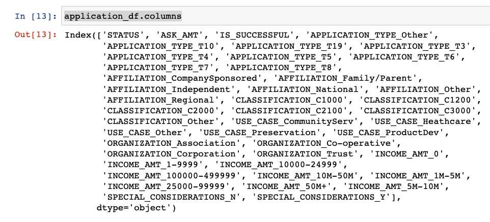
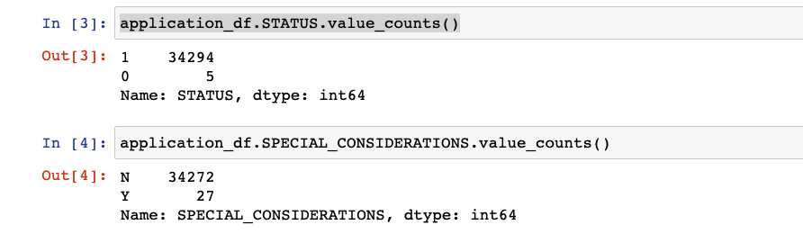
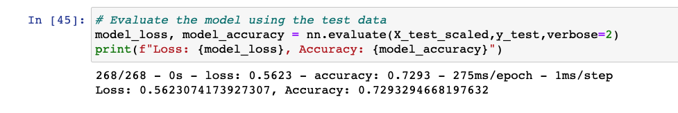

# Neural_Network_Charity_Analysis

## Overview
THe purpose of this project is to create a binary classifier tat is capable of predicting
whether a charity applicant will be successful if funded by Alphabet Soup.

## Results
For our results we address the following questions.

#### Data Processing
	- What variable(s) are considered the target(s) for our model?
	  - We selected "IS_SUCCESSFUL" as our target variable
	- What variable(s) are considered to be the features for our model?
	  - Initially, we considered all the remaining columns as features. After bucketing
	  and encoding, our feature set looked like the image below. Eventually, for optimization
	  we removed a couple more variables to try and obtain a 75% accuracy for our model.

	- What variable(s) are neither targets nor features, and should be removed from the 
	input data?
	  - Initially, we removed "EIN" and the "Name" columns as they do not have any bearing
	  in whether or not an applicant would be successful. Eventually, for optimization
	  we removed more variables to try and obtain a 75% accuracy score for our model

## Summary
In summary, I was unable to achieve the 75% accuracy score for the model. My first optimization
run, I removed two columns as feature variables. I felt that STATUS was ambiguous and the
value counts were very unbalanced. I also, removed SPECIAL_CONSIDERATION as the data too
was unbalanced and I felt it may skew the model.

This yielded a 0.729 Accuracy score.

My second run in optimization, I increased the number of nodes in the first hidden layer
of my model. This too, scored a 0.729

My third run, I increased the nubmer of hidden layers to 3 with slightly less results but
still can consider the score to be 0.729

Lastly, I changed the activation function in muy first hidden layer, but still only scored
a 0.729 for Accuracy.

All in All, I was unable to achieve the 75% accuracy score with my model. I may have to 
explore other features to see if other feature data needs to be cleaned or bucketed or 
transformed. The three features I would start with is "AFFILIATION", "USE_CASE" and "ORGANIZATION"